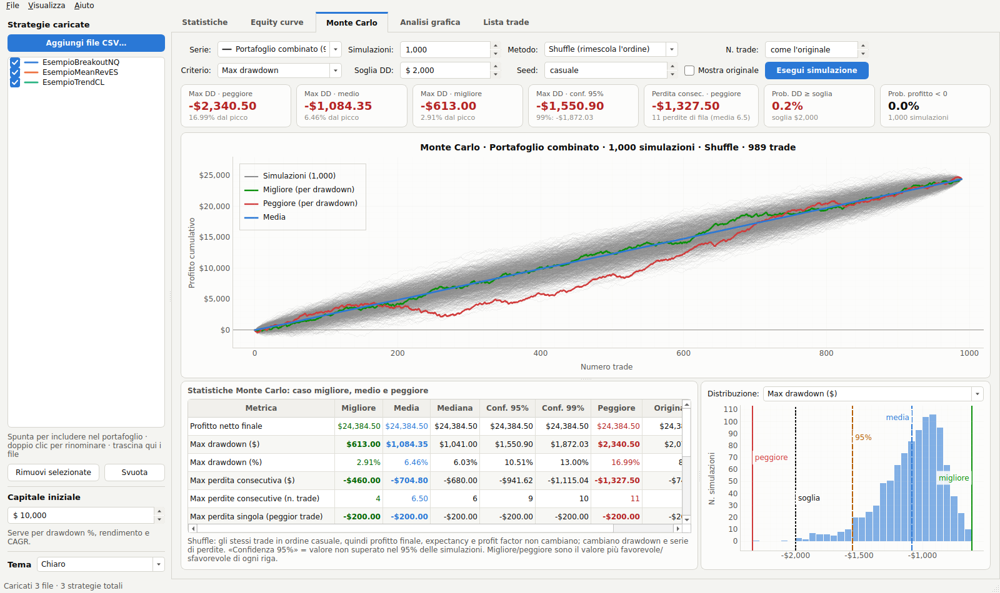
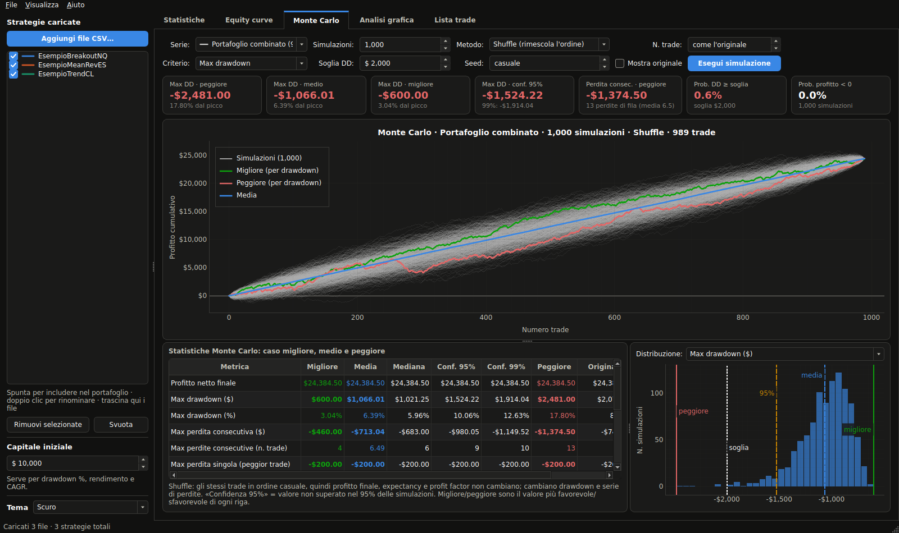
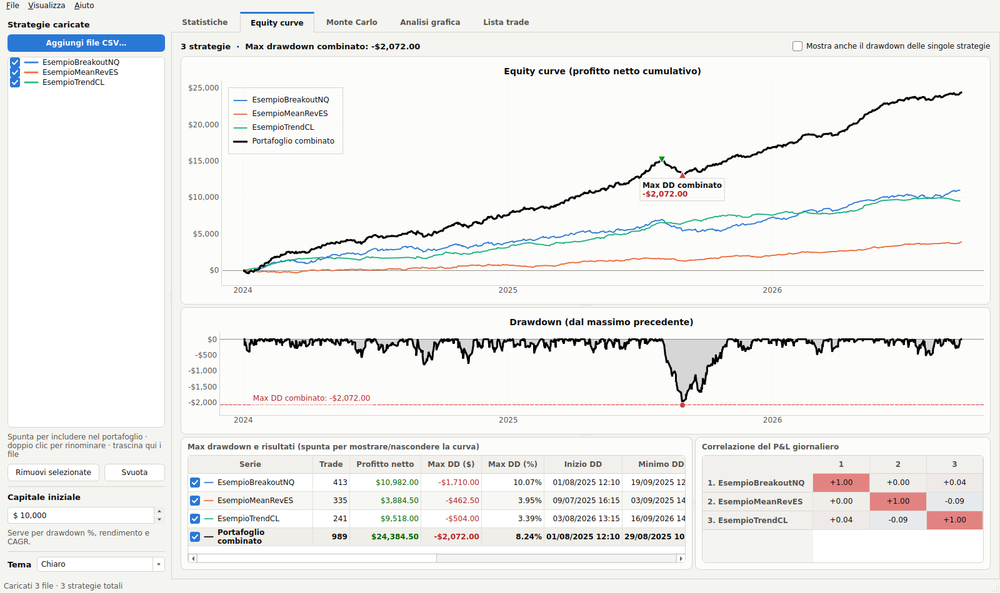
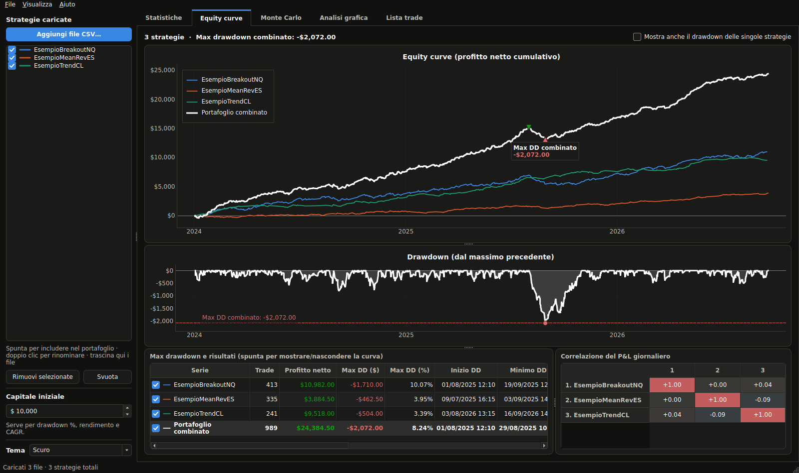
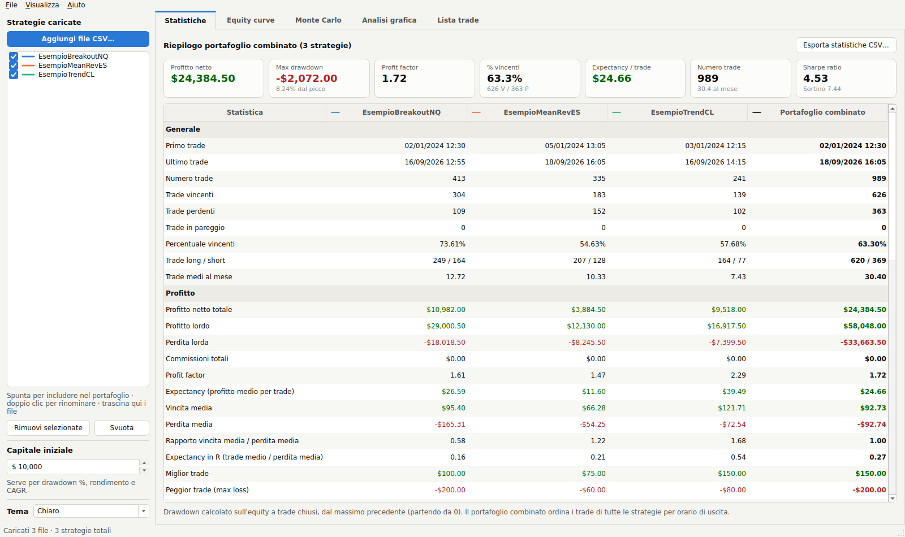

# NT8 Backtest Analyzer

App desktop per Windows che analizza gli export CSV dei backtest di **NinjaTrader 8**:
statistiche complete, equity curve per strategia e combinate, drawdown e simulazione
**Monte Carlo** (shuffler/bootstrap), anche su **più strategie insieme**.



## Funzioni

| Scheda | Cosa mostra |
|---|---|
| **Statistiche** | Oltre 50 metriche per ogni strategia e per il portafoglio combinato: profitto netto, profit factor, expectancy, % vincenti, max drawdown ($ e %), durata e date del drawdown, max perdita consecutiva, peggior giorno/mese, Sharpe, Sortino, SQN, Kelly, CAGR, MAE/MFE/ETD… Esportabili in CSV. |
| **Equity curve** | Una curva per strategia, ognuna di un colore diverso. Con 2 o più strategie compare la curva **nera** (bianca nel tema scuro) del portafoglio combinato, con il suo **max drawdown** evidenziato (picco ▼, minimo ▲) e il grafico del drawdown sotto. Tabella con max DD di ogni strategia e del combinato, e correlazione del P&L giornaliero. |
| **Monte Carlo** | Tutte le simulazioni in **grigio**, la migliore in **verde**, la peggiore in **rosso**, la media in **blu**. Per ogni metrica (max drawdown $ e %, max perdita consecutiva, perdite di fila, peggior trade, durata del drawdown, profitto, recovery factor, expectancy, profit factor, % vincenti): caso migliore, medio, mediana, confidenza 95% e 99%, caso peggiore e valore originale. Probabilità che il drawdown superi una soglia (es. limite prop firm) e istogramma delle distribuzioni. |
| **Analisi grafica** | Per una strategia o il portafoglio: equity, drawdown, P&L per trade, distribuzione, P&L mensile, per ora di entrata, per giorno della settimana, per tipo di uscita, MAE vs risultato e tabella mensile per anno. |
| **Lista trade** | Tutti i trade nell'ordine cronologico combinato, con cumulativo e drawdown. |

Tutti i grafici: rotella per lo zoom, trascina per spostare, passa il mouse per i valori,
tasto destro → *Export* per salvare l'immagine.

### Tema chiaro e scuro

Dalla tendina **Tema** in basso nella barra laterale (o dal menu *Visualizza → Tema*) scegli
**Chiaro**, **Scuro** o **Come il sistema** (segue l'impostazione di Windows). **Ctrl+T** alterna
chiaro e scuro. La scelta viene ricordata; cambiare tema non ricalcola il Monte Carlo.
Nel tema scuro la curva del portafoglio combinato è **bianca** (il nero non si vedrebbe sullo sfondo scuro)
e le altre strategie usano la stessa palette, con tonalità adatte allo sfondo scuro.



## Scaricare e avviare su Windows

### Opzione 1: eseguibile pronto (nessuna installazione)

Ogni push sul branch principale e ogni pull request compilano automaticamente `NT8BacktestAnalyzer.exe`
(workflow *Build Windows*, avviabile anche a mano da *Actions → Build Windows → Run workflow*):

1. Apri la scheda **Actions** del repository → l'ultima esecuzione di **Build Windows**.
2. In fondo alla pagina scarica l'artifact **NT8BacktestAnalyzer-windows** (zip).
3. Estrai lo zip e fai doppio clic su `NT8BacktestAnalyzer.exe`.

Se crei un tag `v1.0.0` l'exe viene allegato anche a una **Release**.
Windows SmartScreen può mostrare un avviso perché l'exe non è firmato: *Ulteriori informazioni → Esegui comunque*.

### Opzione 2: dal codice sorgente

1. Installa [Python 3.10 o superiore](https://www.python.org/downloads/) spuntando *Add python.exe to PATH*.
2. Scarica il repository (pulsante *Code → Download ZIP*) ed estrailo.
3. Doppio clic su **`avvia_app.bat`**: la prima volta installa le dipendenze in `.venv`, poi apre l'app.

Per creare l'exe in locale: doppio clic su **`crea_exe.bat`** → `dist\NT8BacktestAnalyzer.exe`.

## Esportare i trade da NinjaTrader 8

Strategy Analyzer → esegui il backtest → scheda **Trades** → tasto destro sulla griglia →
**Export…** → salva come CSV. Ripeti per ogni strategia che vuoi analizzare.

Poi nell'app: **Aggiungi file CSV…** (selezione multipla) oppure trascina i file nella finestra.
Nella lista a sinistra puoi includere/escludere una strategia dal portafoglio con la spunta
e rinominarla con un doppio clic. Nella cartella `examples/` trovi tre file di prova (dati sintetici).

## Come vengono fatti i calcoli

- **Profitto del trade**: colonna *Profit* dell'export (netto). L'app controlla che la somma coincida con *Cum. net profit*.
- **Portafoglio combinato**: i trade di tutte le strategie incluse vengono uniti e ordinati per **orario di uscita**
  (il momento in cui il profitto/perdita si realizza), poi per orario di entrata.
- **Drawdown**: sull'equity a trade chiusi, dal massimo precedente, partendo da 0.
  Il drawdown % è calcolato su *capitale iniziale + massimo precedente* (capitale impostabile nella barra laterale).
  Per le singole strategie è mostrata anche una stima del drawdown intra-trade usando il MAE.
- **Monte Carlo – Shuffle**: rimescola l'ordine degli stessi trade. Profitto finale, expectancy e profit factor
  restano identici; cambiano drawdown e serie di perdite. La curva media (blu) è quindi una retta.
- **Monte Carlo – Bootstrap**: estrae i trade a caso con reinserimento (anche un numero diverso di trade):
  variano anche profitto finale e % vincenti.
- **Migliore/peggiore (curve verde e rossa)**: la simulazione con drawdown minore/maggiore (criterio modificabile:
  profitto finale o profitto/drawdown). Nella tabella, *migliore* e *peggiore* sono il valore più favorevole e
  più sfavorevole di ogni metrica tra tutte le simulazioni; *confidenza 95%* è il valore non superato nel 95% dei casi.

## Formati supportati

L'export standard di NinjaTrader 8 (come quello in `examples/`): separatore `,` o `;`, importi tipo `$100.00`,
`($2.00)` o `1.234,56 €`, date `M/g/aaaa h:mm:ss AM/PM` oppure `gg/mm/aaaa hh:mm:ss`.

## Sviluppo

```
pip install -r requirements-dev.txt
python main.py examples/*.csv         # avvio (--tema chiaro|scuro|sistema per forzare il tema)
python -m pytest -q                   # test (anche dell'interfaccia, in modalità offscreen)
python -m PyInstaller --noconfirm --clean NT8BacktestAnalyzer.spec   # eseguibile
```

Struttura:

```
main.py                      avvio
nt8analyzer/parser.py        lettura CSV NinjaTrader
nt8analyzer/models.py        TradeSet e unione cronologica delle strategie
nt8analyzer/metrics.py       statistiche e drawdown
nt8analyzer/montecarlo.py    simulazione Monte Carlo (vettoriale, numpy)
nt8analyzer/portfolio.py     strategie incluse + portafoglio combinato
nt8analyzer/ui/              interfaccia PySide6 + pyqtgraph
tools/genera_esempi.py       genera i CSV di esempio
tests/                       test pytest
```




