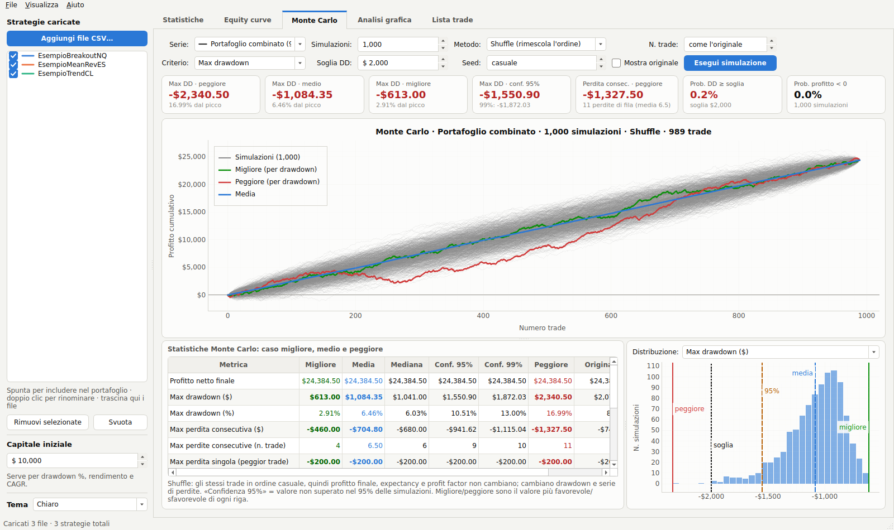
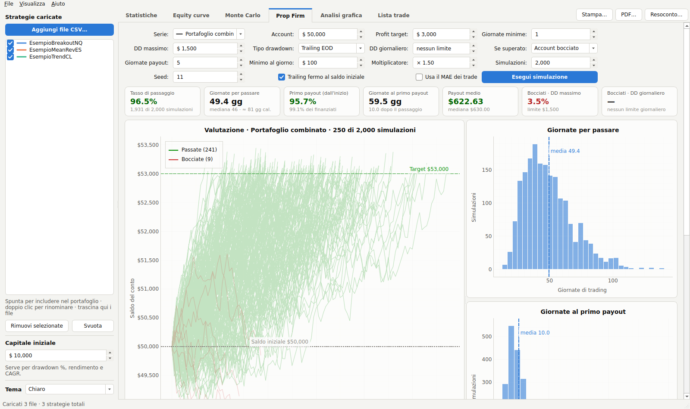
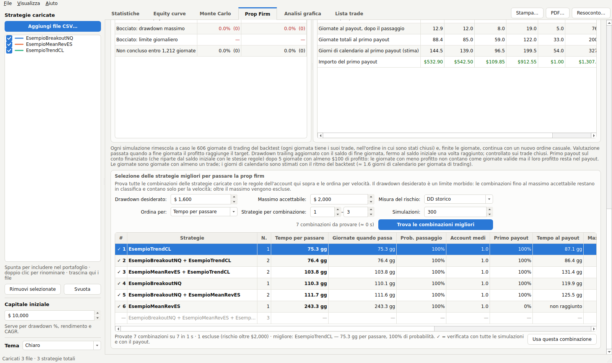
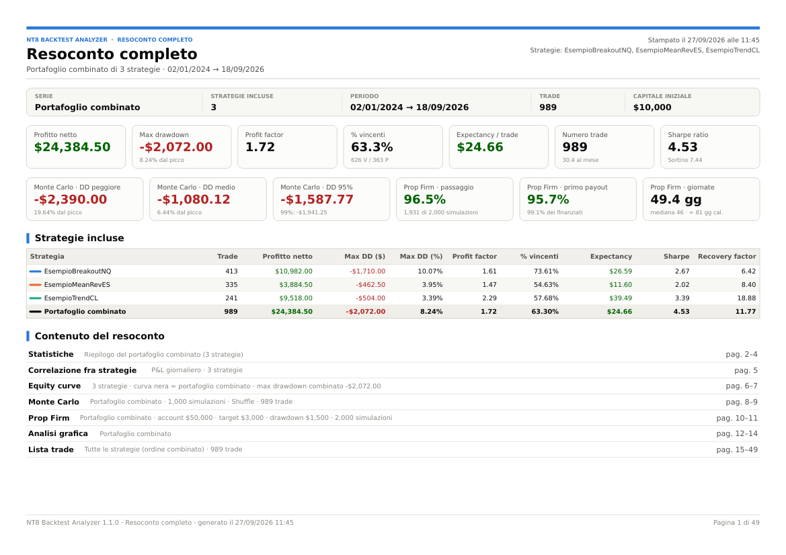
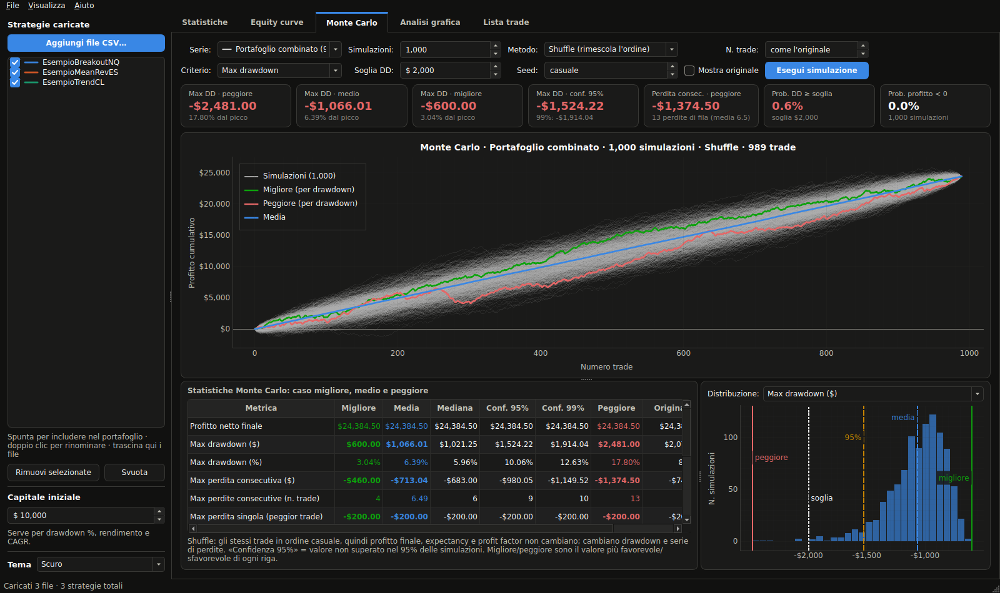
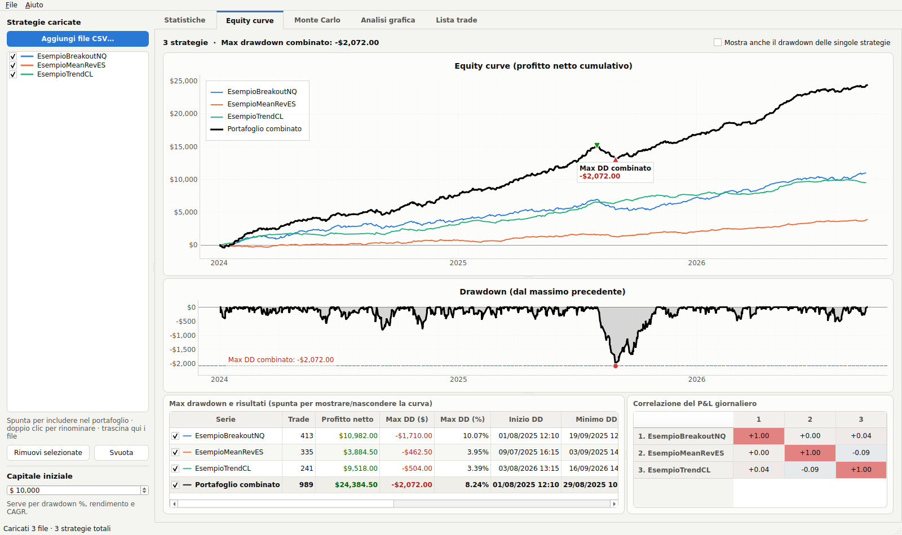
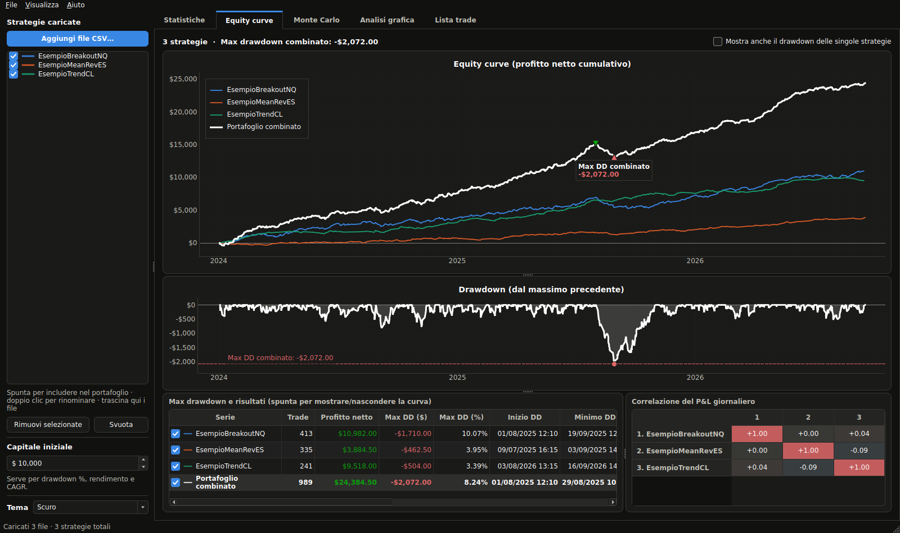
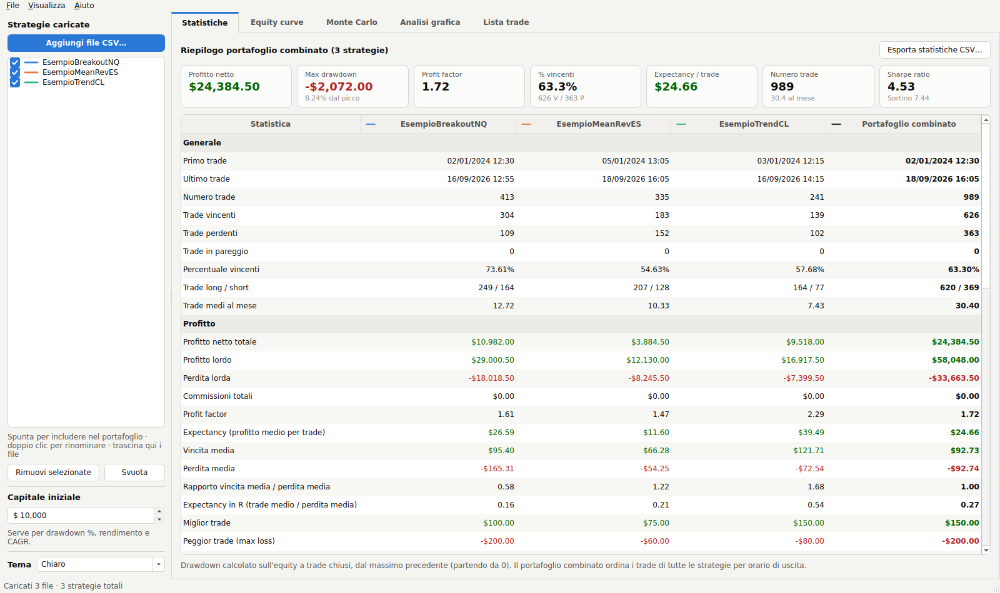

# NT8 Backtest Analyzer

App desktop per Windows che analizza gli export CSV dei backtest di **NinjaTrader 8**:
statistiche complete, equity curve per strategia e combinate, drawdown, simulazione
**Monte Carlo** (shuffler/bootstrap) e **simulazione di account prop firm**, anche su **più strategie insieme**.
Ogni scheda si stampa (o si salva in PDF) e c'è un **resoconto completo** di tutto.



## Funzioni

| Scheda | Cosa mostra |
|---|---|
| **Statistiche** | Oltre 50 metriche per ogni strategia e per il portafoglio combinato: profitto netto, profit factor, expectancy, % vincenti, max drawdown ($ e %), durata e date del drawdown, max perdita consecutiva, peggior giorno/mese, Sharpe, Sortino, SQN, Kelly, CAGR, MAE/MFE/ETD… Esportabili in CSV. |
| **Equity curve** | Una curva per strategia, ognuna di un colore diverso. Con 2 o più strategie compare la curva **nera** (bianca nel tema scuro) del portafoglio combinato, con il suo **max drawdown** evidenziato (picco ▼, minimo ▲) e il grafico del drawdown sotto. Tabella con max DD di ogni strategia e del combinato, e correlazione del P&L giornaliero. |
| **Monte Carlo** | Tutte le simulazioni in **grigio**, la migliore in **verde**, la peggiore in **rosso**, la media in **blu**. Per ogni metrica (max drawdown $ e %, max perdita consecutiva, perdite di fila, peggior trade, durata del drawdown, profitto, recovery factor, expectancy, profit factor, % vincenti): caso migliore, medio, mediana, confidenza 95% e 99%, caso peggiore e valore originale. Probabilità che il drawdown superi una soglia (es. limite prop firm) e istogramma delle distribuzioni. |
| **Prop Firm** | Inserisci le regole dell'account (dimensione, profit target, drawdown massimo trailing o statico, drawdown giornaliero, giornate minime) e le condizioni del payout (giornate valide con un profitto minimo): l'app rimescola a caso le giornate di trading del backtest, ognuna con i suoi trade, e calcola il **tasso di passaggio**, le **giornate medie per passare**, la probabilità di arrivare al **primo payout**, le giornate per arrivarci e l'importo medio del payout. Prova anche tutte le combinazioni di strategie per trovare quelle che passano **nel minor tempo** con il rischio che scegli. |
| **Analisi grafica** | Per una strategia o il portafoglio: equity, drawdown, P&L per trade, distribuzione, P&L mensile, per ora di entrata, per giorno della settimana, per tipo di uscita, MAE vs risultato e tabella mensile per anno. |
| **Lista trade** | Tutti i trade nell'ordine cronologico combinato, con cumulativo e drawdown. |

Tutti i grafici: rotella per lo zoom, trascina per spostare, passa il mouse per i valori,
tasto destro → *Export* per salvare l'immagine.

### Prop Firm



- **Drawdown massimo**: *Trailing EOD* (sale con il saldo di fine giornata), *Trailing intraday* (sale dopo ogni
  trade chiuso) o *Statico* (fisso sotto il saldo iniziale). Con "Trailing fermo al saldo iniziale" il limite
  smette di salire quando arriva al saldo iniziale, come nella maggior parte delle prop firm.
- **Drawdown giornaliero**: perdita massima in una giornata; **0 = nessun limite**. Se superato l'account è
  bocciato, oppure (a scelta) si smette di tradare fino al giorno dopo.
- **Payout**: dopo il passaggio il conto finanziato riparte dal saldo iniziale con le stesse regole; il primo
  payout arriva dopo *N* giornate con almeno il profitto minimo. Una giornata sotto il minimo (es. +80 $ con
  minimo 100 $) **non conta** come giornata valida, ma i suoi 80 $ **restano nel payout**.
- **Moltiplicatore P&L** per scalare i trade (es. 0,1 da mini a micro) e opzione per controllare i limiti anche
  sulla perdita massima toccata durante il trade (**MAE**).
- Risultati: tasso di passaggio, giornate per passare (e stima in giorni di calendario), probabilità e giornate
  per il primo payout, payout medio, percentuali di bocciatura per drawdown massimo e giornaliero, grafico dei
  percorsi (verdi le valutazioni passate, rosse le bocciate) e distribuzioni dei tempi.

#### Selezione delle strategie migliori



In fondo alla scheda Prop Firm, **Trova le combinazioni migliori** prova **tutte le combinazioni** delle strategie
caricate (anche quelle senza spunta) con le regole dell'account e le mette in classifica per velocità.

- **Drawdown desiderato** e **massimo accettabile**: il desiderato è un limite morbido. Per esempio, con desiderato
  2.000 $ e massimo 2.500 $ una combinazione con drawdown di 2.400 $ resta in classifica (in arancione, "oltre il
  desiderato") e conta solo quanto è veloce; oltre 2.500 $ viene esclusa.
- **Misura del rischio**: il max drawdown storico della combinazione nel backtest, oppure il drawdown raggiunto
  durante le valutazioni simulate (95% delle simulazioni).
- **Ordina per**:
  - *Tempo per passare* (predefinito): giornate medie per avere il conto finanziato, comprando un nuovo account a
    ogni bocciatura. Premia la velocità anche a costo di bruciare qualche account;
  - giornate quando passa;
  - probabilità di passare;
  - tempo al primo payout.
- Nella tabella: probabilità di passare, account medi da acquistare, primo payout, drawdown storico e in
  valutazione. Le prime 10 (✓) sono ricalcolate con tutte le simulazioni e con il payout.
- **Usa questa combinazione** (o doppio clic sulla riga) lascia nel portafoglio solo quelle strategie e mostra la sua
  simulazione nella scheda. La classifica è anche nella stampa della scheda Prop Firm e nel resoconto.

Con molte strategie le combinazioni crescono in fretta (10 strategie = 1.023 combinazioni, circa 35 s): si può
limitare il numero di strategie per combinazione.

### Stampa e PDF

Ogni scheda ha il suo modello di stampa: **Stampa…** in alto a destra accanto alle schede
(o *File → Stampa pagina corrente…*, **Ctrl+P**) apre l'anteprima e stampa la scheda che stai guardando.
**PDF…** (*File → Esporta pagina corrente in PDF…*, **Ctrl+Maiusc+P**) la salva direttamente in PDF.

**Resoconto…** (*File → Resoconto completo*, **Ctrl+Maiusc+R**) raccoglie tutte le schede in un unico documento:
prima pagina con i valori principali, le strategie e l'**indice con i numeri di pagina**, poi statistiche,
correlazione fra strategie, equity curve, Monte Carlo, Prop Firm, analisi grafica e lista trade.
Nella finestra del resoconto scegli il **foglio verticale od orizzontale** e **togli la spunta alle sezioni o alle
singole pagine** che non vuoi stampare (la numerazione segue le pagine scelte); poi *Anteprima e stampa* o *Salva PDF*.
Anche l'intervallo di pagine della finestra di stampa di Windows funziona. L'orientamento del foglio si sceglie
anche da *File → Orientamento del foglio*, o dall'anteprima.

Il report ha lo stesso stile dell'app, a colori e sempre su sfondo bianco (anche se usi il tema scuro):
intestazione con titolo e data, riepilogo (serie, periodo, trade, capitale), riquadri con i valori principali,
grafici ad alta risoluzione ridisegnati per la larghezza del foglio e tabelle con i colori di ogni strategia.
Le tabelle lunghe continuano sulle pagine successive. **Con molte strategie** la tabella delle statistiche viene
divisa in gruppi ("Strategie 1–6 di 12", "Strategie 7–12 di 12"): ogni gruppo inizia su una pagina nuova, ha
tutte le righe e ripete la colonna del portafoglio combinato per il confronto. La **tabella di correlazione**
fra strategie è nel foglio delle statistiche, in quello dell'equity curve e ha una sezione propria nel resoconto,
con le coppie più e meno correlate.

| Scheda | Contenuto della stampa |
|---|---|
| Statistiche | Valori principali, tabella completa per strategia e portafoglio combinato, correlazione |
| Equity curve | Equity curve (curve visibili come nell'app), drawdown, max drawdown per strategia, correlazione |
| Monte Carlo | Parametri, caso migliore/medio/peggiore, grafico delle simulazioni, tabella e distribuzione (la simulazione non viene rifatta) |
| Prop Firm | Regole, tasso di passaggio e payout, percorsi delle simulazioni, esiti, tempi e distribuzioni |
| Analisi grafica | Tutti i 9 grafici della serie selezionata e P&L mensile per anno |
| Lista trade | Tutti i trade della selezione con cumulativo e drawdown (sul foglio verticale si omettono MAE, MFE e prezzi) |



### Tema chiaro e scuro

Dalla tendina **Tema** in basso nella barra laterale (o dal menu *Visualizza → Tema*) scegli
**Chiaro**, **Scuro** o **Come il sistema** (segue l'impostazione di Windows). **Ctrl+T** alterna
chiaro e scuro. La scelta viene ricordata; cambiare tema non ricalcola il Monte Carlo.
Nel tema scuro la curva del portafoglio combinato è **bianca** (il nero non si vedrebbe sullo sfondo scuro)
e le altre strategie usano la stessa palette, con tonalità adatte allo sfondo scuro.



## Scaricare e avviare su Windows

### Opzione 1: eseguibile pronto (nessuna installazione)

Scarica `NT8BacktestAnalyzer.exe` dall'ultima **Release** del repository (pagina *Releases* a destra),
poi fai doppio clic sul file. Nella release trovi anche `esempi-csv.zip` con i file di prova.

In alternativa, ogni push sul branch principale e ogni pull request compilano automaticamente l'exe
(workflow *Build Windows*, avviabile anche a mano da *Actions → Build Windows → Run workflow*):

1. Apri la scheda **Actions** del repository → l'ultima esecuzione di **Build Windows**.
2. In fondo alla pagina scarica l'artifact **NT8BacktestAnalyzer-windows** (zip).
3. Estrai lo zip e fai doppio clic su `NT8BacktestAnalyzer.exe`.

Le release si pubblicano da sole: quando sul branch principale arriva una versione nuova
(`__version__` in `nt8analyzer/__init__.py`, es. `1.0.1`), il workflow crea la release `v1.0.1` con l'exe
e i file di esempio. In alternativa: *Actions → Build Windows → Run workflow* con il campo *release_tag*,
oppure invia un tag `v*`. Le note della release vengono da `docs/release-notes/<tag>.md`.

Windows SmartScreen può mostrare un avviso perché l'exe non è firmato: *Ulteriori informazioni → Esegui comunque*.

### Opzione 2: dal codice sorgente

1. Installa [Python 3.10 o superiore](https://www.python.org/downloads/) spuntando *Add python.exe to PATH*.
2. Scarica il repository (pulsante *Code → Download ZIP*) ed estrailo.
3. Doppio clic su **`avvia_app.bat`**: la prima volta installa le dipendenze in `.venv`, poi apre l'app.

Per creare l'exe in locale: doppio clic su **`crea_exe.bat`** → `dist\NT8BacktestAnalyzer.exe`.

## Esportare i trade da NinjaTrader 8

Strategy Analyzer → esegui il backtest → scheda **Trades** → tasto destro sulla griglia →
**Export…** → salva come CSV. Ripeti per ogni strategia che vuoi analizzare.

Poi nell'app: **Aggiungi file CSV…** (selezione multipla) oppure trascina i file nella finestra.
Nella lista a sinistra puoi includere/escludere una strategia dal portafoglio con la spunta
e rinominarla con un doppio clic. Nella cartella `examples/` trovi tre file di prova (dati sintetici).

## Come vengono fatti i calcoli

- **Profitto del trade**: colonna *Profit* dell'export (netto). L'app controlla che la somma coincida con *Cum. net profit*.
- **Portafoglio combinato**: i trade di tutte le strategie incluse vengono uniti e ordinati per **orario di uscita**
  (il momento in cui il profitto/perdita si realizza), poi per orario di entrata.
- **Drawdown**: sull'equity a trade chiusi, dal massimo precedente, partendo da 0.
  Il drawdown % è calcolato su *capitale iniziale + massimo precedente* (capitale impostabile nella barra laterale).
  Per le singole strategie è mostrata anche una stima del drawdown intra-trade usando il MAE.
- **Monte Carlo – Shuffle**: rimescola l'ordine degli stessi trade. Profitto finale, expectancy e profit factor
  restano identici; cambiano drawdown e serie di perdite. La curva media (blu) è quindi una retta.
- **Monte Carlo – Bootstrap**: estrae i trade a caso con reinserimento (anche un numero diverso di trade):
  variano anche profitto finale e % vincenti.
- **Prop Firm**: le giornate di trading (data di uscita dei trade) vengono messe in ordine casuale; finite le
  giornate si continua con un nuovo ordine casuale. Target e payout si controllano a fine giornata, i limiti di
  drawdown dopo ogni trade (o sul MAE, se attivato); se in un trade si superano sia il limite giornaliero sia il
  drawdown massimo, scatta quello toccato per primo.
- **Migliore/peggiore (curve verde e rossa)**: la simulazione con drawdown minore/maggiore (criterio modificabile:
  profitto finale o profitto/drawdown). Nella tabella, *migliore* e *peggiore* sono il valore più favorevole e
  più sfavorevole di ogni metrica tra tutte le simulazioni; *confidenza 95%* è il valore non superato nel 95% dei casi.

## Formati supportati

L'export standard di NinjaTrader 8 (come quello in `examples/`): separatore `,` o `;`, importi tipo `$100.00`,
`($2.00)` o `1.234,56 €`, date `M/g/aaaa h:mm:ss AM/PM` oppure `gg/mm/aaaa hh:mm:ss`.

## Sviluppo

```
pip install -r requirements-dev.txt
python main.py examples/*.csv         # avvio (--tema chiaro|scuro|sistema per forzare il tema)
python main.py --screenshots out examples/*.csv   # PNG di ogni scheda + PDF (schede e resoconto) in out/stampa
python -m pytest -q                   # test (anche dell'interfaccia, in modalità offscreen)
python -m PyInstaller --noconfirm --clean NT8BacktestAnalyzer.spec   # eseguibile
```

Struttura:

```
main.py                      avvio
nt8analyzer/parser.py        lettura CSV NinjaTrader
nt8analyzer/models.py        TradeSet e unione cronologica delle strategie
nt8analyzer/metrics.py       statistiche e drawdown
nt8analyzer/montecarlo.py    simulazione Monte Carlo (vettoriale, numpy)
nt8analyzer/portfolio.py     strategie incluse + portafoglio combinato
nt8analyzer/propfirm.py      simulazione account prop firm (valutazione e primo payout)
nt8analyzer/ui/              interfaccia PySide6 + pyqtgraph
nt8analyzer/ui/report.py     impaginazione A4 dei report (stampante, PDF, immagini)
nt8analyzer/ui/print_templates.py   modello di stampa di ogni scheda e resoconto completo
nt8analyzer/ui/report_dialog.py     finestra del resoconto (pagine e orientamento)
tools/genera_esempi.py       genera i CSV di esempio
tests/                       test pytest
```




